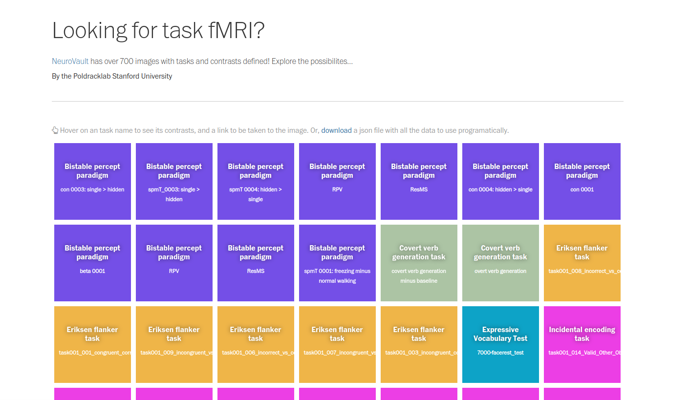

# Cognitive Atlas + NeuroVault

This was an old application to link NeuroVault maps to Cognitive Atlas Contrasts.



A static demo [is available](https://vsoch.github.io/cogat-neurovault/)
The demo is taken down, but can be built locally (and run) with a container.

```bash
$ docker build -t vanessa/flask-cogat-neurovault .
```

Or to run directly from Docker Hub:

```bash
$ docker run -p 5000:5000 vanessa/flask-cogat-neurovault
```

Then open to [http://localhost:5000/neurovault](http://localhost:5000/neurovault).
